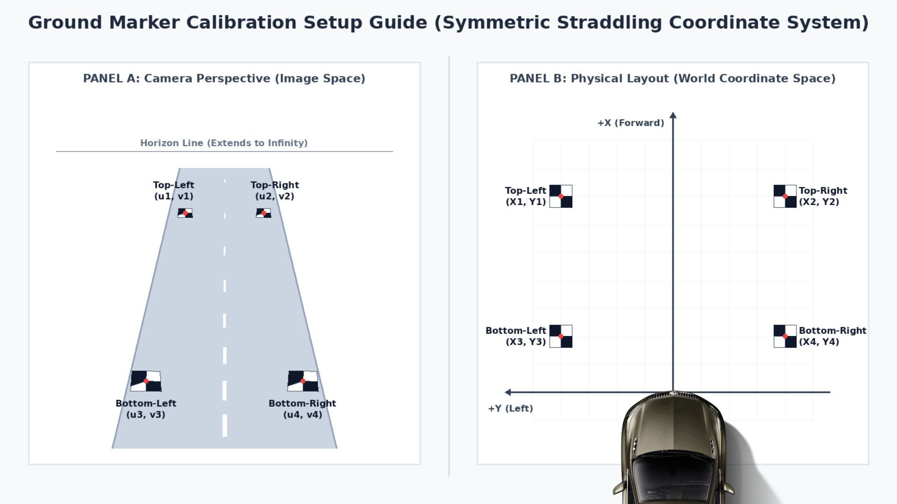

# Extrinsic Camera Calibration & Homography Mapping via Ground Checkerboards

The script **calc_front_camera_homography.py** provides a highly robust, automated Python tool to calculate the **Homography Matrix ($H$)** that maps 2D camera image coordinates $(u, v)$ to flat 3D real-world road coordinates $(X, Y)$.

By leveraging exactly **four 2x2 ground-plane checkerboard markers**, the script automatically detects calibration target intersections with sub-pixel accuracy, structures them relative to physical coordinates, solves the homography system, and outputs a visual validation grid backprojected directly onto your camera frame.

## 1. Physical Calibration Setup

To establish a highly precise mapping from pixels to physical road coordinates, you must place four **2x2 black-and-white checkerboard targets** flat on the asphalt surface. 

### Ground Layout Diagram:


### Step-by-Step Ground Marker Placement:

1. **Print/Create Four 2x2 Checkerboard Targets:**
   * A 2x2 checkerboard consists of two black and two white squares meeting in the middle.
   * **Crucial Detail:** The exact intersection point at the center serves as the single pixel-accurate coordinate $(u,v)$.
   
2. **Lay Out the Grid on the Ground:**
   * Using an A4 papger, print out four copies of the [checkerboard grid pattern](checkerboard-bw.png), each page should have one 2x2 checkerboard pattern on it. Place the checkerboards on the flat asphalt in front of the vehicle in a rectangular pattern such that they are visible to the camera and firmly tape the pages flat to the road surface.
   * Ensure they do not slide or warp.

3. **Measure Your Coordinates:**
   * Pick the centre of the front bumper of your vehicle to act as your **World Coordinate Origin $(0,0)$**
   * Measure the precise physical distancefrom the World Coordinate Origin to the Bottom-Right to each of the four checkerboard centres and record them, ensuring you write down which of the checkerboards the measurement belongs to (top-left, top-right, bottom-left, and bottom-right)

### Coordinate Mapping Reference:

| Target Location | Image Coord Label | World Coordinates $(X, Y)$ |
| :--- | :---: | :---: |
| **Top-Left** | $(u_1, v_1)$ | $(X1, Y1)$ |
| **Top-Right** | $(u_2, v_2)$ | $(X2, Y2)$ |
| **Bottom-Left** | $(u_3, v_3)$ | $(X3, Y3)$ |
| **Bottom-Right** | $(u_4, v_4)$ | $(X4, Y4)$ |


---

## 2. How the Script Works

The pipeline executes through five distinct stages:

1. **Sub-Pixel Corner Extraction:**
   OpenCV’s `cv2.findChessboardCorners` is executed with a target pattern size of `(1,1)` (which detects a single 2x2 checkerboard intersection). The coordinate is then refined down to sub-pixel accuracy using `cv2.cornerSubPix`.
   
2. **Iterative Detection & Space Masking:**
   Because a standard image has multiple identical targets, the script searches iteratively. Once it localizes a target center, it masks that region out of the grayscale search space with a solid white circle of radius $R = \max(\text{width}, \text{height})/20$ to ensure subsequent iterations lock onto different boards.
   
3. **Robust Spatial Sorting:**
   The four detected points are automatically clustered and mapped using their image coordinates:
   * **Rows (Top vs. Bottom):** Coordinates are sorted vertically by their $v$ pixel locations. The two points closest to the horizon line (smaller $v$ values) form the "top" row; the two closest to the camera (larger $v$ values) form the "bottom" row.
   * **Columns (Left vs. Right):** Inside each row, the points are sorted horizontally by their $u$ pixel locations (lower $u$ is Left, higher $u$ is Right).
   
4. **Homography Solver:**
   Using the sorted image coordinates $(u, v)$ and your corresponding CLI-provided physical coordinates $(X,Y)$, OpenCV computes the $3 \times 3$ homography matrix $H$ using the Direct Linear Transform (DLT) algorithm:
   $$\begin{bmatrix} X \\ Y \\ 1 \end{bmatrix} \sim H \begin{bmatrix} u \\ v \\ 1 \end{bmatrix}$$
   This matrix is written natively into a serialized `FileStorage` configuration standard (`H.yaml`).

5. **Inverse Backprojection Overlay:**
   The script takes the inverse homography $H^{-1}$ to project a mathematically perfect uniform grid from world coordinate boundaries $[0 \le X \le W, 0 \le Y \le L]$ back onto the perspective camera image space. It renders these as green virtual lanes and horizontal rings to demonstrate the calibration alignment.

---

## 3. Run the script

Execute the script by feeding it your captured camera frame along with the physical coordinates measured from your real-world marker grid, an example is shown below - ensure to save your H-matrix in the [VisionPilot/config](../VisionPilot/config/) folder

```bash
python calc_homography_2x2.py --img road_frame.jpg \
  --out ../VisionPilot/config/H_custom.yaml \
  --tl 0.0 15.0 \
  --tr 3.7 15.0 \
  --bl 0.0 0.0 \
  --br 3.7 0.0
```

### Commandline Arguments
- **--img** - Path to the captured source calibration image file.
- **--out** - Target file path where the evaluated Homography matrix should be saved.
- **--tl** - Top-Left Marker World Coordinates: X (depth), Y (horizontal offset).
- **--tr** - Top-Right Marker World Coordinates: X (depth), Y (horizontal offset).
- **--bl** - Bottom-Left Marker World Coordinates: X (depth), Y (horizontal offset).
- **--br** - Bottom-Right Marker World Coordinates: X (depth), Y (horizontal offset).

---

### File Output (H.yaml)
The Homography matrix is saved and can be used by Vision Pilot

### Visualization Output
The script automatically produces an overlay visualization image saved as <your_out_name>_visualization.png.

**Green Lines:** Represent a uniform physical grid drawn on the road floor, projected back into perspective. If your calibration is accurate, these lines will align perfectly parallel to existing road lines, and compress correctly as they approach the horizon.

**Red Circles:** Indicate the identified centers of your checkerboards, printed with text labels (Top-Left, Top-Right, etc.) confirming the correct identification pairing

---

### Troubleshooting & Best Practices

#### No Corners Found:

Ensure high-contrast illumination on the road. Shadows cast directly across a checkerboard can cause corner detection to fail.

Adjust cv2.findChessboardCorners flags if you have reflective pavement.

### Extreme Camera Tilts:

Spatial sorting assumes the camera has minimal roll. If the camera is tilted sideways by more than 45 degrees, the vertical separation logic may mix up the left-right pairing. Keep the camera level during calibration.

### Lines Distorting Into Sky (Horizon Errors):

Straight lines projected past the horizon line can mathematically "wrap around" and render incorrectly. The code utilizes a custom perspective-depth filter (homog_img[:, 2] > 1e-5) to clip segments extending into infinite space safely.